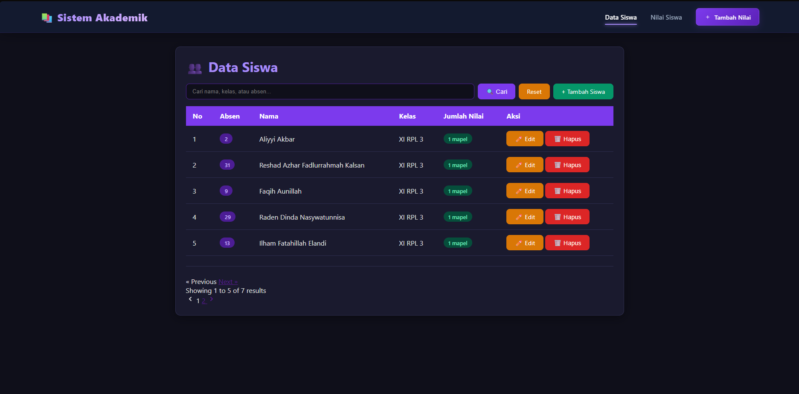
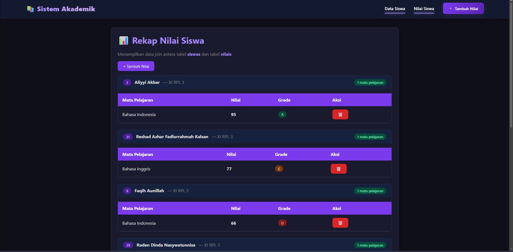
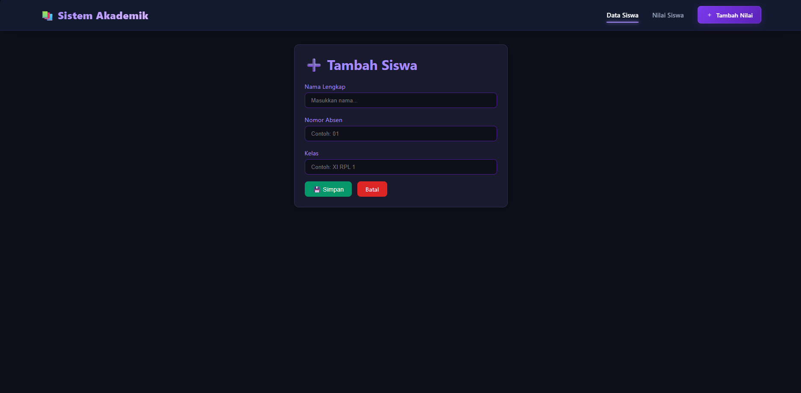
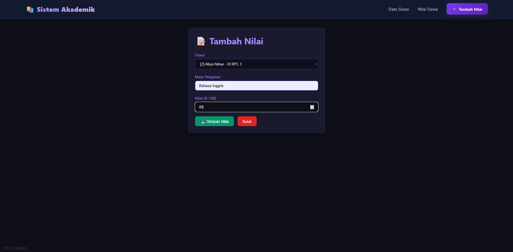

# 📚 Sistem Akademik — Laravel Eloquent ORM

> Tugas Pertemuan Laravel Eloquent — XI RPL  
> Studi kasus: manajemen data siswa dan nilai akademik

---

## 👤 Identitas

| | |
|---|---|
| **Nama** | *(isi nama kamu)* |
| **Kelas** | XI RPL *(isi nomornya)* |
| **Absen** | *(isi nomor absen)* |

---

## 📋 Deskripsi Project

Aplikasi web berbasis **Laravel** untuk mengelola data siswa dan nilai akademik. Dibangun menggunakan **Eloquent ORM** sebagai penghubung antara kode PHP dan database MySQL, dengan tampilan antarmuka *dark theme* kustom.

---

## ✅ Checklist Tugas

| No | Ketentuan | Status |
|----|-----------|--------|
| 1 | Tambah 1 Model relevan → **Model Nilai** | ✅ |
| 2 | Tampilkan data hasil join Siswa + Nilai | ✅ |
| 3 | Fitur tambahan: **Search + Pagination** | ✅ |
| 4 | Kode di GitHub + README dengan hasil web | ✅ |
| 5 | Custom style (dark purple theme) | ✅ |

---

## 🗄️ Skema Database

### Tabel `siswas`
| Kolom | Tipe | Keterangan |
|-------|------|------------|
| id | bigint (PK) | Primary key auto increment |
| nama | varchar | Nama lengkap siswa |
| absen | varchar | Nomor absen |
| kelas | varchar | Kelas siswa |
| created_at | timestamp | Waktu data dibuat |
| updated_at | timestamp | Waktu data diperbarui |

### Tabel `nilais`
| Kolom | Tipe | Keterangan |
|-------|------|------------|
| id | bigint (PK) | Primary key auto increment |
| siswa_id | bigint (FK) | Foreign key → siswas.id |
| mata_pelajaran | varchar | Nama mata pelajaran |
| nilai | integer | Nilai 0–100 |
| created_at | timestamp | Waktu data dibuat |
| updated_at | timestamp | Waktu data diperbarui |

---

## 🔗 Relasi Eloquent

```
Siswa ──── hasMany ────▶ Nilai
Nilai ──── belongsTo ──▶ Siswa
```

- Satu **Siswa** dapat memiliki banyak **Nilai** (one-to-many)
- Setiap **Nilai** dimiliki oleh satu **Siswa**

```php
// Model Siswa
public function nilais() {
    return $this->hasMany(Nilai::class);
}

// Model Nilai
public function siswa() {
    return $this->belongsTo(Siswa::class);
}
```

---

## ✨ Fitur Aplikasi

- **CRUD Siswa** — tambah, lihat, edit, hapus data siswa
- **CRUD Nilai** — tambah dan hapus nilai per siswa
- **Join View** — halaman rekap yang menampilkan data dari dua tabel sekaligus
- **Search** — cari siswa berdasarkan nama, kelas, atau absen
- **Pagination** — tampil 5 data per halaman
- **Grade Otomatis** — A (≥90), B (≥80), C (≥70), D (<70)
- **Dark Theme** — antarmuka kustom bernuansa ungu gelap

---

## 🖥️ Tampilan Web

### Halaman Data Siswa (`/siswa`)
Menampilkan tabel seluruh siswa lengkap dengan fitur search, pagination, tombol edit dan hapus.



---

### Halaman Rekap Nilai — Join (`/siswa/nilai`)
Menampilkan hasil **join** tabel `siswas` dan `nilais`. Setiap siswa tampil beserta seluruh nilai mata pelajarannya, dilengkapi badge grade otomatis.



---

### Halaman Tambah Siswa (`/siswa/create`)
Form input untuk menambahkan data siswa baru ke database.



---

### Halaman Tambah Nilai (`/nilai/create`)
Form input nilai dengan dropdown pemilihan siswa.



---

## 🛣️ Daftar Routes

| Method | URL | Controller | Fungsi |
|--------|-----|-----------|--------|
| GET | `/siswa` | SiswaController@index | Tampilkan semua siswa + search |
| GET | `/siswa/create` | SiswaController@create | Form tambah siswa |
| POST | `/siswa` | SiswaController@store | Simpan siswa baru |
| GET | `/siswa/{id}/edit` | SiswaController@edit | Form edit siswa |
| PUT | `/siswa/{id}` | SiswaController@update | Update data siswa |
| DELETE | `/siswa/{id}` | SiswaController@destroy | Hapus siswa |
| GET | `/siswa/nilai` | SiswaController@nilaiSiswa | **Join** siswa + nilai |
| GET | `/nilai/create` | NilaiController@create | Form tambah nilai |
| POST | `/nilai` | NilaiController@store | Simpan nilai baru |
| DELETE | `/nilai/{id}` | NilaiController@destroy | Hapus nilai |

---

## 🚀 Cara Menjalankan

```bash
# 1. Clone repository
git clone https://github.com/USERNAME/NAMA-REPO.git
cd NAMA-REPO

# 2. Install dependencies
composer install

# 3. Salin file environment
cp .env.example .env

# 4. Generate app key
php artisan key:generate

# 5. Atur koneksi database di file .env
DB_CONNECTION=mysql
DB_HOST=127.0.0.1
DB_PORT=3306
DB_DATABASE=nama_database_kamu
DB_USERNAME=root
DB_PASSWORD=

# 6. Jalankan migrasi
php artisan migrate

# 7. Jalankan server
php artisan serve
```

Buka browser ke `http://localhost:8000`

---

## 🧱 Struktur Folder Penting

```
app/
├── Http/Controllers/
│   ├── SiswaController.php
│   └── NilaiController.php
├── Models/
│   ├── Siswa.php
│   └── Nilai.php
database/
└── migrations/
    ├── xxxx_create_siswas_table.php
    └── xxxx_create_nilais_table.php
resources/views/
├── layouts/
│   └── main.blade.php
├── siswa/
│   ├── index.blade.php
│   ├── create.blade.php
│   ├── edit.blade.php
│   └── nilai.blade.php
└── nilai/
    └── create.blade.php
routes/
└── web.php
```

---

## 🛠️ Teknologi


- **Framework:** Laravel 10+
- **ORM:** Eloquent
- **Database:** MySQL
- **Templating:** Laravel Blade
- **Styling:** Custom CSS (dark purple theme)

---

*Dibuat untuk tugas mata pelajaran Rekayasa Perangkat Lunak — XI RPL*